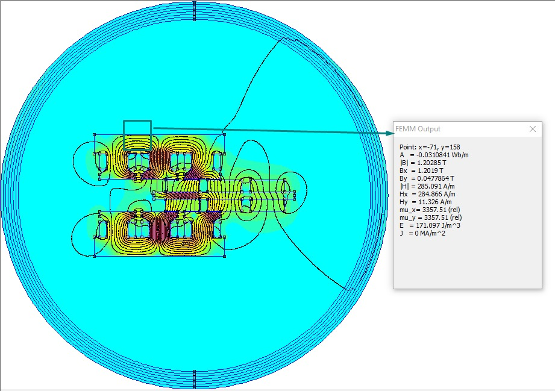

## Linear Motor

Hi, In this case we are simulating a Linear Motor as the first Picture


With ``linearMotor.py`` we create the sketch and run the simulation.


## Commands

### Without shift
```
    python linearMotor.py 0
```

### 1/4 shift
```
    python linearMotor.py 1
```

### 1/2 shift
```
    python linearMotor.py 2
```




## Do you wanna all the technical Information?

You can find a PDF file with the technical information about analysis and Simulations, but it is in spanish we will work on the English version soon. Also you can learn Spanish, is Fun!!!

# Creators
Roberto Sanchez   
Germán Andrés Jején Cortés   
Mauricio Alvarez   
Daniel Maldonado   